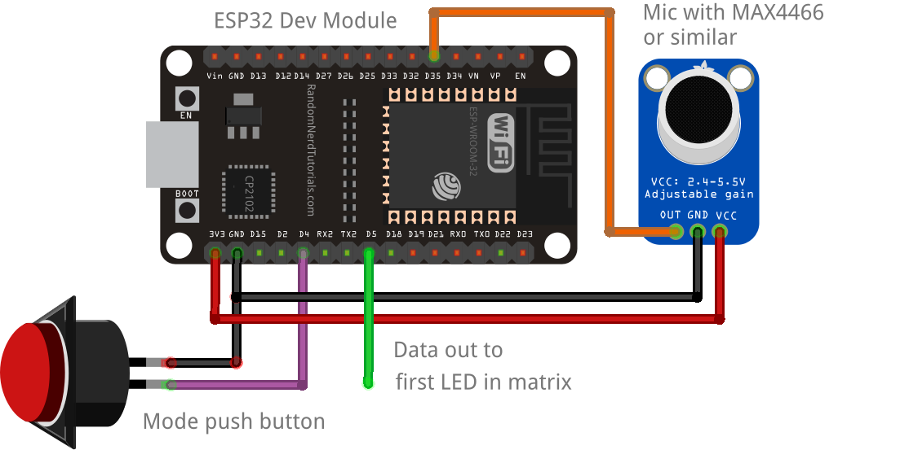

This code originally came from: https://github.com/s-marley/ESP32_FFT_VU
It has been simplified and edited to be used for workshops.

# ESP32_FFT_VU
A spectrum analyzer VU meter running a 40kHz FFT on an ESP32 and outputting to a 16 x 16 FastLED matrix. The code is heavily modified from [this example](https://github.com/G6EJD/ESP32-8266-Audio-Spectrum-Display/blob/master/ESP32_Spectrum_Display_02.ino) originally written by G6EJD.

## Demo
If you are planning on using this code, it is advisable to watch the YouTube video below explaining how it works. Please note, the code has changed to use FastLED Neomatrix since the video was produced thanks to [VonHirsch](https://github.com/VonHirsch/). See 'Installation and code usage' below.

## Setting up the circuit
When choosing the pin for your button, be careful. Some pins on the ESP32 don't have pullup resistors, and if you choose one of these the button won't work! When I was testing, I found that D2 didn't work, but D4 did so I went with that one.

### Microphone

This is much simpler than the line in method, but you will be limited to the frequencies that you can detect by the sensititivy of the microphone. You need a mic with on-board amplification, commonly something like the MAX4466 which can be bought cheaply from eBay or alixepress. You would get better results with an I2S microphone, but that is beyond the scope of this project. Turn up the gain on whatever microphone you have. The mic should be connected to GND, 3V3 and the output pin to D35. Pin D5 is the LED data pin and is connected to the first LED in the matrix. Pin D2 is connected to a momentary push button which is used to change display modes.

## Installation and code usage
1. Download this repository and open ESP32_FFT_VU.ino.
2. If this is your first time connecting an ESP32 board, you need to add it to your ArduinoIDE.
    1. Go to `File->Preferences->Additional Board Manager URLs`
    2. Enter in: https://raw.githubusercontent.com/espressif/arduino-esp32/gh-pages/package_esp32_index.json
    3. click "Ok" to close out of preferences. It should begin to add something.
    4. Go to `Tools->Board->Board Manager`
    5. A panel should pop up, and search "ESP32"
    6. Download the version by Espressif Systems
    7. Now to set the board, go to `Tools->Board->esp32->"ESP32 Dev Module"`
3. From the Arduino library manager, you will need:
    - FastLED Neomatrix
    - EasyButton libraries . 
    - arduinoFFT library (Seems to work, but reports of `DCRemoval()` not working. If this is the case, so download it from the [GitHub repository](https://github.com/kosme/arduinoFFT) and install it from a zip file [`Sketch->Include Library->Add .ZIP Library`])
    
    - To load the Arduino FFT (or other) library:

        - In the IDE menu, select `Sketch->Include Library-> Manage Libraries->search for 'FFT'` 
                The correct version is :// https://github.com/kosme/arduinoFFT
4. Watch the video to see how to use it.
5. To customsise it to your own matrix layout, read about Neomatrix layouts at [Adafruit](https://learn.adafruit.com/adafruit-neopixel-uberguide/neomatrix-library#layouts-2894555-5).

## Other notes:
Make sure that the Serial Monitor is using 115200 Baud rate. Also, upload speed should be the same (find this option under "Tools")

If you try to upload and it cannot find a connection, you may need to hold down the 'boot' button on the ESP32 until it starts writing.

## Controls
The matrix is controlled from a single button. The functions are:
- Single press: Change pattern

