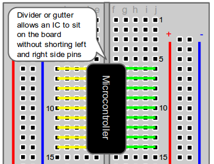
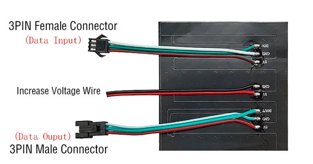
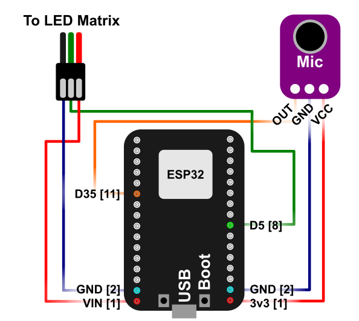

This code originally came from: https://github.com/s-marley/ESP32_FFT_VU
It has been simplified and edited to be used for workshops.

## Hardware setup

Before Plugging into the breadboard, view the following diagrams to know how the wiring works on a breadboard.

Due to the size of the ESP32, you will need to have it straddle two breadboards. 

The LED matrix has 3 sets of wires as seen in the picture below:

Since we are working with a single matrix, we don't need to worry about the 'increase voltage wire' or the '3PIN Male Connector'. You want to connect to the Data Input - Female Connector. This is easy to distinguish as it is the only one that you should be able to insert a jumper cable into. 

With this working knowledge, we can connect parts with jumper cables by plugging into the same row without crossing the gutter. The following connections need to be made:
- Connect the data line from the LED matrix to D5 on the ESP32
- Connect the VIN line from the LED matrix to VIN on the ESP32
- Connect the GND line from the LED matrix to GND next to VIN on the ESP32 (should be right next to it)
- Connect the data line (OUT) from the microphone to D35 on the ESP32
- Connect the VCC line from the microphone to 3V3 on the ESP32
- Connect the GND line from the microphone to GND next to the 3V3 on the ESP32 (should be right next to it)
- Connect the ESP32 to the computer using the microUSB cord. This provides power to the entire system.

## Installation and code usage
1. Download this repository and open W1_spectrumAnalyzer.ino.
2. If this is your first time connecting an ESP32 board, you need to add it to your ArduinoIDE.
    1. Go to `File->Preferences->Additional Board Manager URLs`
    2. Enter in: https://raw.githubusercontent.com/espressif/arduino-esp32/gh-pages/package_esp32_index.json
    3. click "Ok" to close out of preferences. It should begin to add something.
    4. Go to `Tools->Board->Board Manager`
    5. A panel should pop up, and search "ESP32"
    6. Download the version by Espressif Systems (version 2.0.14 works)
    7. Now to set the board, go to `Tools->Board->esp32->"ESP32 Dev Module"`

3. From the Arduino library manager, you will need:
    - FastLED Neomatrix (by Marc Merlin v1.1.0)
    - arduinoFFT library (by Enrique Condes v1.6.2)
    
    - To load the Arduino FFT (or other) library:

        - In the IDE menu, select `Sketch->Include Library-> Manage Libraries->search for 'FFT'` 
                The correct version is https://github.com/kosme/arduinoFFT

You may also need the ESP32 driver: https://www.silabs.com/developers/usb-to-uart-bridge-vcp-drivers (install instructions in the Release Notes text file of the download)

## Other notes:
Make sure that the Serial Monitor is using 115200 Baud rate. Also, upload speed should be the same (find this option under "Tools")

If you try to upload and it cannot find a connection, you may need to hold down the 'boot' button on the ESP32 until it starts writing.

## Workshop Guide!
Each workshop is contained within its own folder. There is a markdown (or PDF) file within the folder that contains the instructions for that workshop. You can render a markdown file in Visual Studio code by using (Ctrl+K then V).

The workshops are meant to be done in the following order, as time permits:
1. W1_spectrumAnalyzer
2. W2_detectNote

## If you finish early
You can look to customsise your own matrix layout, read about Neomatrix layouts at [Adafruit](https://learn.adafruit.com/adafruit-neopixel-uberguide/neomatrix-library#layouts-2894555-5).

