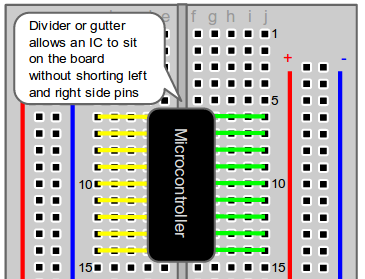

# Workshop Introduction Guide!

Before we get into the fun coding challenges, we want to make sure everyone has enough background knowledge.
For this, we need to get an understanding of the arduino programming environment, some basic coding skills, and then get into what an LED matrix is, and how do we control it. 

## Goals
Here we will get an understanding of Arduino programming, the FastLED programming package, as well as the RGBMatrix Library


## Setup Arduino IDE for ESP32 
If this is your first time connecting an ESP32 board, you need to add it to your ArduinoIDE.

1. Go to `File->Preferences->Additional Board Manager URLs`
2. Enter in: https://raw.githubusercontent.com/espressif/arduino-esp32/gh-pages/package_esp32_index.json
3. click "Ok" to close out of preferences. It should begin to add something.
4. Go to `Tools->Board->Board Manager`
5. A panel should pop up, and search "ESP32"
6. Download the version by Espressif Systems (version 2.0.14 works)
7. Now to set the board, go to `Tools->Board->esp32->"ESP32 Dev Module"`

If your computer is not recognizing the ESP32 as being connected, you may also need the ESP32 driver: https://www.silabs.com/developers/usb-to-uart-bridge-vcp-drivers (install instructions in the Release Notes text file of the download). Another possible source of this error is that the wrong "COM" port is selected from the Tools dropdown menu. 

## Basics
Arduino code needs to be broken up into 3 main blocks. You will see this structure when you start any new script:
1. Define all the necessary variables that the code needs to run (e.g. pin locations for connected hardware)
2. The 'setup' function - which tells the chip what to run at the very beginning to get things set up for the main function. This only runs once at boot or reset.
3. The 'loop' function - which contains the code that you plan to run continuously 


## Datatypes

Arduino has several primary data types to work with:

1. Integer (int): Used for whole numbers. Range: -32,768 to 32,767.
2. Unsigned Integer (unsigned int, u_int): Similar to int but only for non-negative numbers. Range: 0 to 65,535.
3. Long (long): For larger whole numbers. Range: -2,147,483,648 to 2,147,483,647.
4. Unsigned Long (unsigned long): Same as long but only positive. Range: 0 to 4,294,967,295.
5. Float (float): For floating-point numbers (decimals). Precision: 6-7 decimal digits.
6. Double (double): It's essentially the same as float on most Arduino boards, not offering double-precision.
7. Byte (byte): Stores an 8-bit unsigned number, 0 to 255.
8. Char (char): Stores a single character. A 'string' is made up of multiple characters.
9. Boolean (bool): Represents true or false.

## Hello World

We need to start setting the arduino internal clock in the setup() function. The following line will set the rate to 9600:

```Serial.begin(9600);```

The we need to put something in the loop() function. The following line will print the contents in the brackets into the serial monitor. 

```Serial.println("Hello World!");```

We will also add a delay. The delay(time) function pauses the code for the amount of 'time' defined in milliseconds. Here, lets add a 3 second delay with the following code in the loop():

```delay(1000);```

Next press the Upload button. Once uploaded, open the 'Serial Monitor' which can be found in the Tools drop down menu. You should see "Hello World!" appear in the serial monitor, every 3 seconds.

** If the serial monitor isn't printing properly, check the Baud rate at the top right of the Serial Monitor, and make sure it matches the value set in the setup() function.

## Setup and Loop functions

To convince ourselves that setup runs only once, put the first line in setup, and the second line in loop, and check the serial monitor. Leave the Serial.begin and delay lines from before. 

```Serial.println("Running the setup function");```

```Serial.println("Running the loop function");```

## Defining variables

We can set variables to take on values before the setup and loop functions. We might want to do this if there are things that we don't want to change, or to prefill variables with values. We can try this out by defining two variables and printing their summation. At the top of the script insert the two lines of code:
```
int val1 = 2;
int val2 = 3; 
int resultNumber = 0;
```
We can leave the setup() function. In the loop() function, lets start it by printing the result:
```Serial.println(resultNumber);```

Then lets increment the resultNumber by val1+val2. This can be done with:

```resultNumber += val1 + val2;```

Insert the delay code from before so that the serial monitor doesn't print values too quickly. Upload the code to the chip and check the result in the serial monitor. If done correctly, it should count by 5.

## ESP32 LED Blink
The ESP32 dev board has a LED built in. To use it, we need to 'define' it at the beginning of the code:

`#define LED 2`

Then in the setup() function, include this:

`pinMode(LED,OUTPUT);`

This tells the board that it is connected to interface pin 2, and that this pin is used to output (not take data in, like a microphone might). We can then make the LED blink by putting the following in the loop() function:

```
delay(500);
digitalWrite(LED,HIGH);
delay(500);
digitalWrite(LED,LOW);
```

digitalWrite sets the pin defined by the first variable to either a high (5 or 3.3 Volt) state, or a low (0 Volt) state. In this case, it will turn the LED on (high) or off (low).

## For loops
Conditional statements are very common in programming. This tells the computer to do something only under certain circumstances. We can modify the above LED example to use a 'for' loop instead. The following code will do 5 blinks, before taking a longer (1.5 second) 'off' period. Clear your loop() function and insert the following code:

```
for (int i = 0; i < 5; i++) {
  digitalWrite(LED, HIGH);  // Turn the LED on
  delay(500);                       // Wait for half a second
  digitalWrite(LED, LOW);   // Turn the LED off
  delay(200);
}
delay (1000);
```                      

## If and Else loops
These are other conditional statements that cause code to be executed when certain conditions are met. Let's modify the above example so that the 5th blink is 2 seconds long and the others are still half a second:
```
for (int i = 0; i < 5; i++) {
  digitalWrite(LED, HIGH);  // Turn the LED on
 if ( i == 4) { // Only on the 5th blink
   delay(2000); // Wait for a full second
 } else { // for all other blinks
   delay(500); // Wait for half a second
 }                    
  digitalWrite(LED, LOW);   // Turn the LED off
  delay(200);
}
delay (1000);
```

Note that arduino programming uses 0 indexing. This means we start counting at 0 and not at 1. That makes the 5th light to be count 4 (0, 1, 2, 3, 4).

#################################################################################
# LED Matrix
Now that we have the basics covered, lets take a jump and add the LED matrix. First we need to wire it up. 

## Hardware setup

Before Plugging into the breadboard, view the following diagrams to know how the wiring works on a breadboard.


Due to the size of the ESP32, you will need to have it straddle two breadboards. 



The LED matrix has 3 sets of wires as seen in the picture below:


Since we are working with a single matrix, we don't need to worry about the 'increase voltage wire' or the '3PIN Male Connector'. You want to connect to the Data Input - Female Connector. This is easy to distinguish as it is the only one that you should be able to insert a jumper cable into. 

With this working knowledge, we can connect parts with jumper cables by plugging into the same row without crossing the gutter. The following connections need to be made:
- Connect the data line from the LED matrix to D5 on the ESP32
- Connect the VIN line from the LED matrix to VIN on the ESP32
- Connect the GND line from the LED matrix to GND next to VIN on the ESP32 (should be right next to it)
- Connect the data line (OUT) from the microphone to D35 on the ESP32
- Connect the VCC line from the microphone to 3V3 on the ESP32
- Connect the GND line from the microphone to GND next to the 3V3 on the ESP32 (should be right next to it)
- Connect the ESP32 to the computer using the microUSB cord. This provides power to the entire system.


## Download packages
These are needed to help us control the LED with less effort, and for later on in the workship.
From the Arduino library manager, you will need:

  - FastLED Neomatrix (by Marc Merlin v1.1.0)
  - arduinoFFT library (by Enrique Condes v2.0.2)
  - Adafruit_GFX // graphics support for matrix (v1.11.11)
  
  - To load the Arduino FFT (or other) library:
      - In the IDE menu, select `Sketch->Include Library-> Manage Libraries->search for 'FFT'` 
              The correct version is https://github.com/kosme/arduinoFFT

### To add FastLED matrix option:
Add the following code BEFORE the setup() function:

```
#include <Adafruit_GFX.h> // New for this one -> graphics support
#include <FastLED_NeoMatrix.h>


#define LED_PIN 5
const uint8_t kMatrixWidth = 16;                          // Matrix width
const uint8_t kMatrixHeight = 16;                         // Matrix height
#define NUM_LEDS       (kMatrixWidth * kMatrixHeight)     // Total number of LEDs
#define CHIPSET         WS2812B                           // LED strip type
#define COLOR_ORDER     GRB                               // If colours look wrong, play with this
#define MATRIX_TILE_H       1  // number of matrices arranged horizontally
#define MATRIX_TILE_V       1  // number of matrices arranged vertically
uint8_t matrix_brightness = 50;

CRGB leds[NUM_LEDS];

FastLED_NeoMatrix *matrix = new FastLED_NeoMatrix(leds, kMatrixWidth, kMatrixHeight, MATRIX_TILE_H, MATRIX_TILE_V, 
  NEO_MATRIX_TOP     + NEO_MATRIX_RIGHT +
    NEO_MATRIX_ROWS + NEO_MATRIX_ZIGZAG + 
    NEO_TILE_TOP + NEO_TILE_LEFT +  NEO_TILE_PROGRESSIVE);

/* some RGB color definitions in unint16_t                                                */
#define Black           0x0000      /*   0,   0,   0 */
#define Navy            0x000F      /*   0,   0, 128 */
#define DarkGreen       0x03E0      /*   0, 128,   0 */
#define DarkCyan        0x03EF      /*   0, 128, 128 */
#define Maroon          0x7800      /* 128,   0,   0 */
#define Purple          0x780F      /* 128,   0, 128 */
#define Olive           0x7BE0      /* 128, 128,   0 */
#define LightGrey       0xC618      /* 192, 192, 192 */
#define DarkGrey        0x7BEF      /* 128, 128, 128 */
#define Blue            0x001F      /*   0,   0, 255 */
#define Green           0x07E0      /*   0, 255,   0 */
#define Cyan            0x07FF      /*   0, 255, 255 */
#define Red             0xF800      /* 255,   0,   0 */
#define Magenta         0xF81F      /* 255,   0, 255 */
#define Yellow          0xFFE0      /* 255, 255,   0 */
#define White           0xFFFF      /* 255, 255, 255 */
#define Orange          0xFD20      /* 255, 165,   0 */
#define GreenYellow     0xAFE5      /* 173, 255,  47 */
#define Pink            0xF81F
```

Then in the setup() function, we will switch to a higher baud rate for later on. We also need to define some settings for the LEDs. Include the following code:

```
  Serial.begin(115200);
  FastLED.addLeds<CHIPSET, LED_PIN, COLOR_ORDER>(leds, NUM_LEDS).setCorrection(TypicalLEDStrip);
  matrix->begin();
  matrix->setBrightness(matrix_brightness);
```

## LED Matrix Basics:
The bottom of your loop() function needs to have the following code, which tells the matrix to update:

`matrix->show();`

Draw a pixel in solid white. This function can take in RGB

`matrix->drawPixel(0, 0, CRGB( 150, 150, 150) );`

Fill the screen with green. This function needs to use the binarized colors

`matrix->fillRect(0, 0, kMatrixWidth, kMatrixHeight,  Green );`

Draw a box in yellow

`matrix->drawRect(0, 0, kMatrixWidth, kMatrixHeight,  Yellow );`

Draw an 'X' in red
```
matrix->drawLine(0, 0, kMatrixWidth, kMatrixHeight, Red);
matrix->drawLine(kMatrixWidth-1, 0, 0, kMatrixHeight-1, Red);
```

Fill a maroon circle

`matrix->fillCircle(2, 7, 2, Maroon);`

Draw a blue circle

`matrix->drawCircle(8, 7, 7, Blue);`

Fill the screen with 'black'

`matrix->fillScreen(Black);`

You could combine the above to draw images, like a happy face! Or use loops to display different things at different time points. You could also use an online tool (such as:https://tools.withcode.uk/bitmap/) to convert an image into bitmap code, and then draw each of the pixels.

## Writing on the screen:
There is a matrix print option which is similar to serial print.  But we first need to set where our cursor will be. The following will go in our loop() function:
```
// draw some text!
  matrix->setCursor(1, 0);   // start at top left, with one pixel of spacing
  matrix->setTextSize(1);    // size 1 == 8 pixels high
 
  // print each letter in alternating green and orange
  matrix->setTextColor(Green);
  matrix->print('E');
  matrix->setTextColor(Orange); 
  matrix->print('S');
  matrix->setTextColor(Green);
  matrix->print('P');
  matrix->setTextColor(Orange); 
  matrix->print('3');
  matrix->setTextColor(Green);  
  matrix->print('2');
 
```

You should see that the print function automatically moves the text to the next available space on the matrix. If we don't turn off text wrapping, then it automatically prints to the next line. You can see this effect by adding the following to your setup() function:
`matrix->setTextWrap(false);`

It does not really make sense to loop over a print call. So you might want to add some animation, or put in a delay, or move this to the setup() function. 

## Scrolling Text
We can achieve scrolling text by using the above combined with a 'for' loop to navigate across. We will need to set a scroll speed which effectively acts as a delay:

`int scrollSpeed = 150; // milliseconds`

Let's also set the message we want as a string"

`char LEDmessage[] = "Hello!";  `

We need some other definitions related to the hardware:
```
// This is the same as above
#define LED_PIN 5
const uint8_t kMatrixWidth = 16;                          // Matrix width
const uint8_t kMatrixHeight = 16;                         // Matrix height
#define NUM_LEDS       (kMatrixWidth * kMatrixHeight)     // Total number of LEDs
#define CHIPSET         WS2812B                           // LED strip type
#define COLOR_ORDER     GRB                               // If colours look wrong, play with this
#define MATRIX_TILE_H       1  // number of matrices arranged horizontally
#define MATRIX_TILE_V       1  // number of matrices arranged vertically
uint8_t matrix_brightness = 50;

// This is new:
int x    = kMatrixWidth; // Value to keep track of cursor position
int y    = 5; // Helps to center text 
int stringPixLength = strlen(LEDmessage) * 7; // Assumes each letter may be ~ 8 pixels wide with a space

// Color definitions - you can pick the one you like most! I will continue with WHITE in setup(), Or include all of the colours from before. 
#define BLACK 0x0000
#define BLUE 0x001F
#define RED 0xF800
#define WHITE 0xFFFF
```


We need to set up the LED matrix. Here we will add force no wrapping of text for our scrolling animation. So in the setup() function include the following:
```
  Serial.begin(115200);
  FastLED.addLeds<CHIPSET, LED_PIN, COLOR_ORDER>(leds, NUM_LEDS).setCorrection(TypicalLEDStrip);
  matrix->begin();
  matrix->setBrightness(matrix_brightness);
  matrix->setTextWrap(false); 
  matrix->setTextSize(1);
  matrix->setTextColor( WHITE ); 
```

The magic happens in the loop() function. It is best to start by clearing the matrix. We will make the text scroll by continually modifying x. 
```
  FastLED.clear(); // erase text from last loop. 
  matrix->setCursor(x, y);
  matrix->print( LEDmessage );

  x--; // Decrease x by 1 for next loop to move text to left
  if(x < -stringPixLength) {
    x = kMatrixWidth; // reset word
  } 

  matrix->show();
  delay(scrollSpeed);
```

You could play around with this can change the text colour based on the value of x, or modify the text being printed, or change the scroll speed.

## Snake of increasing length
We can start a snake with a single pixel that then moves through the matrix. After completing, it could start over with a length of 1 pixel longer. We have the same hardware as the previous example, so we will keep the same variable defines section. We can remove the colour defines, and the string and x and y definitions from the last example.  Here, we need to make two arrays to keep track of the x and y coordinates of the snake, and the length of the snake. Insert the following before the setup() function. 
```
uint8_t xPixLoc[NUM_LEDS];
uint8_t yPixLoc[NUM_LEDS];
uint8_t snakeLength = 1;
uint8_t scrollSpeed = 50; // milliseconds
```
 We don't need all the setup code since we aren't using text, so insert the following in the setup() function:
```
  Serial.begin(115200);
  FastLED.addLeds<CHIPSET, LED_PIN, COLOR_ORDER>(leds, NUM_LEDS).setCorrection(TypicalLEDStrip);
  matrix->begin();
  matrix->setBrightness(matrix_brightness);
```
We are going to draw things pixel by pixel. If you want to change the colour, this is where you do it. Remember that drawPixel uses RGB coding for colour determination. 

`matrix.drawPixel(0, 0, CRGB( 150, 150, 150));`

So to draw the snake, we need to loop over the snake length.
```
  FastLED.clear(); 
  for (int i = 0; i < snakeLength; i++) {
    matrix->drawPixel( xPixLoc[i], yPixLoc[i], WHITE);
  }
  matrix->show();
  delay(scrollSpeed); // You may want to make this shorter

```

Lets start by just going across in x, then if we hit the end of x we reset x and go up in y. 

```
  for (uint8_t i = 0; i < snakeLength; i++) {
    uint8_t curX = xPixLoc[i];
    uint8_t curY = yPixLoc[i];

    if (curX < kMatrixWidth-1) {
        xPixLoc[i] +=1; // increase by 1, y stays same

      } else { // we are at end of row
        yPixLoc[i] +=1; // increment by 1
        xPixLoc[i] = 0;
      }

    }
```

Run the above. What happens to the dot at the end? We need to put it back at the start! The logic you use to reset it will depend on where you put the code. We will put it at the end of the loop. At the end of the loop, the dot would be out of bounds if it tries to enter a 17th row (curX == 0 && curY == kMatrixHeight ). We can use an 'if' statement just after updating the coordinates - but still in the for loop for the snake length - to check this and update if needed.

```
      if(curX == 0 && curY == kMatrixHeight) {
        yPixLoc[i] = 0;
        xPixLoc[i] = 0;
      }
```


Next, lets increase the length of the snake when we finish a loop. We have an 'if' statement that checks if we are at the end for a single pixel. We need to expand this so that we only increase the snake length when we are at the end of the snake! Please the following 'if' statement within the 'if' statement we made in the last step:

```
    if (i == snakeLength-1){
      snakeLength++;
    }
```

To get the 'snake' effect, we need to move opposite ways along x for even and odd rows. To separate even and odd rows, we can use the modulus '%' function, which gives us the remainder after a division. If we divide any number by 2, the remainder will be 0 for even numbers, or 1 for odd. The odd rows we will want to decrease x. 


```
 for (uint8_t i = 0; i < snakeLength; i++) {

      // Get the pixel location for this part of snake
      uint8_t curX = xPixLoc[i];
      uint8_t curY = yPixLoc[i];

      // Find out if even or odd row- 
      //our code mostly works for even, except we don't reset x at the end!
      if (curY % 2 == 0) {

        if (curX < kMatrixWidth-1) {
          xPixLoc[i] +=1; // increase by 1, y stays same

        } else { // we are at end of row
          yPixLoc[i] +=1; // increment by 1
        }
      } else { // for odd rows move the opposite way:

        if (curX > 0) {
          xPixLoc[i] -=1; // decrement by 1, y stays same

        } else { // we are at end of row
          yPixLoc[i] +=1; // increment by 1
        }  
      }

      // Our condition for reaching the end stays the same. 
      if(curX == 0 && curY == kMatrixHeight) {
        yPixLoc[i] = 0;
        xPixLoc[i] = 0;
        if (i == snakeLength-1){
          snakeLength++;
        }

      } // end of at end of matrix check

    } // end for snake length
```

I will leave it up to you to determine how to reset the snake length once it fills the matrix! The use of delay here is not ideal, as it means the update rate is not independent of the length of the snake. As the snake gets longer, the number of extra calculations that it needs to do to update the length increases, taking more time. This effectively slows the snake as it gets bigger. For this exercise it is fine, but if you are interested in looking into how to have more consistent timing, look at ExampleApps/countDown.ino

Hopefully from this exercise you can see the challenges in coding. We take something that seems simplistic from an explaination point of view "just make a snake zig-zag across a screen", and have to break it down into all of its sub-components. 

