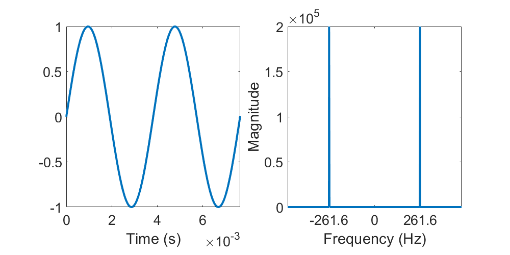
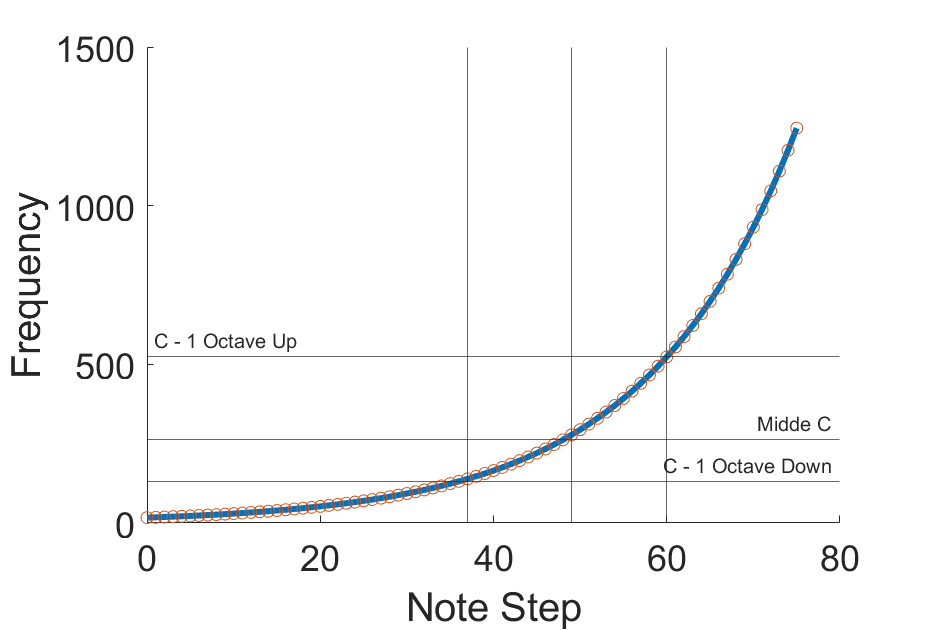
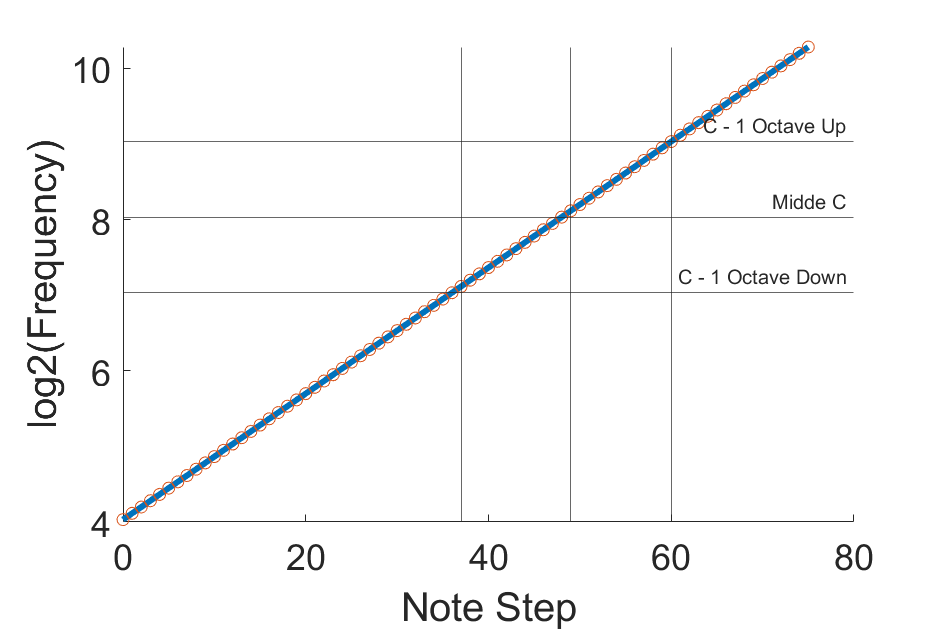
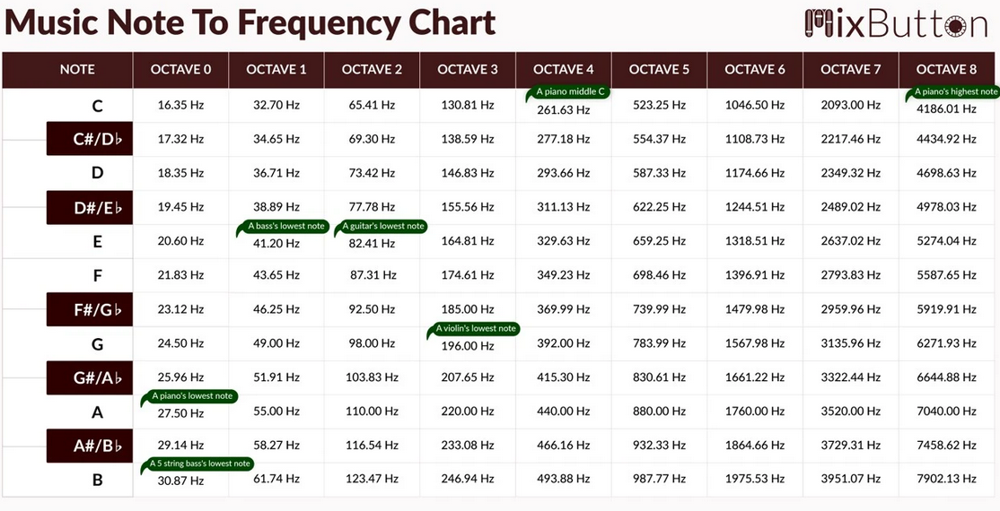
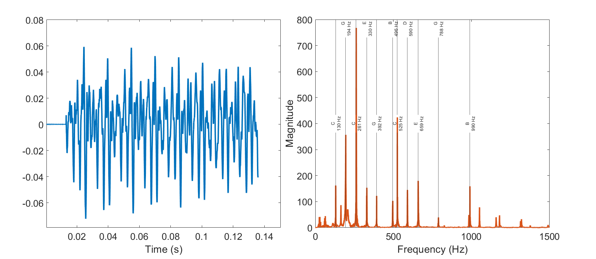
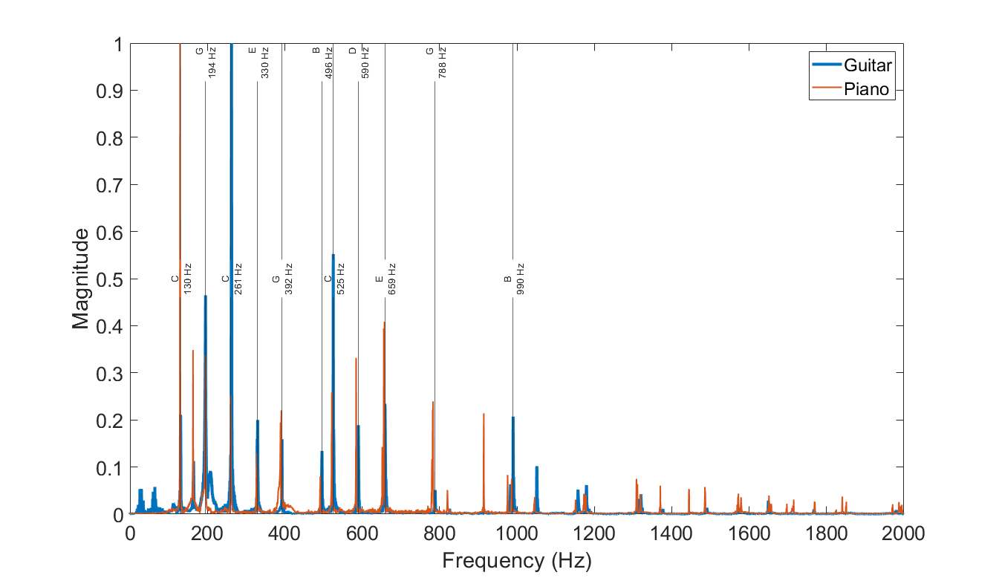

# Workshop Exercise 2 Guide!

Welcome to the music note analyzer workshop! In this workshop, we build aim to build a device that provides the information necessary to tune an instrument.

## Goals
In this workshop, we hope to develop a conceptual understanding of how the frequencies of sound waves map to musical notes. Each instrument obtains its unique sound by producing sound waves at many frequencies. We will apply our knowledge of the Fourier Transform to uncover the dominant frequency in a sound wave, which ends up being the musical tone we perceive the sound to be at. 

From this, we will compare this frequency to a known mathematical model, to determine how this frequency aligns with the primary music notes (i.e. A, A#, B, etc). Primarily, we are looking to convince ourselves that it is possible to take in any incoming sound signal, and break it down into its frequency components. 

## Theory

### Frequency and Music Notes
We will use the "C" note as an example. If we create a sinusodal wave that oscillates as a specific frequency, we obtain two spikes from the Fourier transform (FT).  



In this case, we created a 261.6 Hz wave, and get two peaks following the FT, at -261.6 Hz and +261.6 Hz. The negative values are a consequence of the mathematics, and aren't interpretable for sound. For this exercise, we will ignore them and turn our focus to values above 0. 

This is great! We can determine the frequency content of an incoming sound wave, but how does this map to musical notes? 

We know that the frequency of musical notes changes exponentially, with base 2. We also know that the notes repeat every octave, with 12 different notes within an octave. If we start at some musical note f<sub>0</sub>, we can determine the frequency of a musical note 'n' notes away using the following formula:

<p align="center">f<sub>n</sub> = f<sub>0</sub>* 2<sup>(n/12)</sup> </p>

The means that the frequency of each note varies by a factor of  2<sup>(1/12)</sup> or ~1.05946. If we know that note 'C' in Octave 0 has frequency 16.35 Hz, we can use this as f<sub>0</sub> to map to any other music note. For example, we calculate that the plotted 'Middle C' note is 49 musical note steps away from this base note. 

If we want to see what this looks like as a plot: 



From this, we can clearly see the exponential change of steps in frequency. If we take log2 of both sides of the equation, then we should expect a linear result. If we plot that, we see:



And this is more so how we percieve a change in musical tones, which means our ears are senstive to sound waves in a non-linear manner, even if we percieve them linearly.

In chart form, we can see all the frequencies listed:



The chart points out a few reference values:
- Middle C for the piano is 261.63 Hz
- The A in octave 0 has a frequency of 27.5 Hz, and is the lowest note on a piano
- The piano's highest note is a C in the 8th octave, at 4186.01 Hz
- A guitar's lowest note is the 2nd octave E at 82.41 Hz

### Musical Instruments
To obtain a better appreciation of what separates a 'C' chord in piano and guitar, we will look at the Fourier transform of each. The C Major chord contains the following notes: C, D, E, G, A and B. The soundwave and Fourier transform of a guitar C major chord looks like:



The input audio looks quite random, but from the FT of that signal, we can see has discrete peaks. If we look into the values of these peaks we see that they align with different musical notes! We perceive this to be a 'C' note, because it is the largest peak in the FT. We won't go into the music theory of what other notes best pair to make a nice sounding 'chord'. 

Let us compare the frequency spectrum from a guitar to one from a piano. The piano note is one octave lower to help us visualize differences. 



We have a primary difference of 1 octave in the C notes. But you can see that despite the piano being a lower note, it has more high frequency content that provides its characteristic sound. 

Hopefully this helps illustrate the usefulness of the fourier transform. Now we have a quantitative metric to be able to compare two signals, that provides meaningful interpretation. 

### Bringing It Together
Hopefully from the above, we can see:
- musical instruments differ in sound based on the contributions of additional frequencies
- the musical note we 'hear' is the dominant frequency in the wave
- we can use a mathematical formula to determine the frequency of any musical note

We can make our 'note detector' by pre-computing the frequency values of all the notes in a frequency range of interest (~10-5000 Hz), and then compare our detected frequency to find the closest musical notes.

## Hardware setup
To begin, you should set your hardware up as illustrated in the README.md file and in the W1_spectrumAnalyzer guide. 


## Coding Steps:
1. Start by uploading W2_detectNote.ino to the ESP32 with all the default values. You may need to check that you have the right COM port selected. Hold down the boot button on the ESP32 while uploading. 

2. If the upload was successful, and all the parts are properly connected, then you should see the lights working now if you are in a noisy environment. If not, make some noises to test it! 

3. At the top of the arduino file, we have set up a user configuration zone. The main variable of interest is `NOISE`. This will be a different noise value compared to W1. This noise variable is so that we do not have the LEDs light up when we do not purposely play a sound. This effectively blocks out background noise.  If you are in a noisy location, increasing the `NOISE` variable can help. You can guess and check... Or we can have the ESP32 print us the data values from the microphone to the Serial Monitor. 

4. Go to line ~90 and look for `//Serial.print( peakF,2);`. Remove the `//` to uncomment the line, and the following two lines.Re-upload the sketch to the ESP32. Go to the serial monitor and watch the values popping up on the screen. If you are not making any noise to the microphone, was is an average low value for peakM? Take that value, add 20-50, and set that as the `NOISE` variable. The peakF variable tells you what the peak frequency it is detecting, we will look at this later! Upload that update to the ESP32 and see how it now responds to noise at the bottom (quiet) end. Repeat as necessary so that the lights mostly start to turn on when you deliberately make noise.

5. Now we want to set the peak. First, lets comment out the line from before, by adding `//` back in front of it. Now jump to line ~125 and look for: `// if (band == 3) Serial.println(barHeight);` Uncomment this line, and reupload to ESP32. Just like in the last step, we are watching the serial monitor, but now, looking for the maximum values we see. This time, we want to make some noise (but not too much!), so that we know what we want the value to be for full illumination. Once you find a value, set that as the `AMPLITUDE` variable. Upload that update to the ESP32 and see how it now responds to noise at the top (loud) end. Repeat as necessary so that the lights respond the way you would like them to. You may want to go back to step 4 if you feel like the `NOISE` could be further adjusted. It doesn't need to be perfect, as the level of noise in the room will be changing. You just want it set well enough that you can see how it responds to new incoming noise. 

## Testing Steps:

The hard part is done and now the fun begins! We have the hardware working, and the code configured for our setup, now we want to put it to the test. We have a few audio files to test:

1. We can start by playing the `middle C` file. A single note (created synthetically of course) will consist of a sine wave at a specific frequency. As we play this note, we should see a single bar light up. 
2. Ok, so a single bar could have been a fluke. To test this some more, lets play a `frequency sweep` file. This should have the sound going from a low frequency to a high frequency. If our theory works, then we should see a bar light up on one side, and move across the LED matrix as it moves to a higher pitch.
3. Enough of the synthetic waves! What about real audio? What gives a guitar the sound of a guitar, despite playing the same musical note as a piano? To better visualize this, we may want to adjust the frequencies that the bars of our LED correspond to. While we can hear from ~20- 20,000 Hz, most of the instrument and vocal frequencies are from the 20-10,000 Hz range. The first 5 octaves are all below 1,000 Hz. To better see how we can pick up small differences in notes, copy the following into your code from lines ~98 to ~114, replacing the `if` statements that are there:
```   if (i<=3 )           bandValues[0]  += (int)vReal[i];
      if (i>3   && i<=4  ) bandValues[1]  += (int)vReal[i];
      if (i>4   && i<=5  ) bandValues[2]  += (int)vReal[i];
      if (i>5   && i<=6  ) bandValues[3]  += (int)vReal[i];
      if (i>6   && i<=7  ) bandValues[4]  += (int)vReal[i];
      if (i>7   && i<=9  ) bandValues[5]  += (int)vReal[i];
      if (i>9   && i<=11  ) bandValues[6]  += (int)vReal[i];
      if (i>11   && i<=14  ) bandValues[7]  += (int)vReal[i];
      if (i>14   && i<=18  ) bandValues[8]  += (int)vReal[i];
      if (i>18   && i<=22  ) bandValues[9]  += (int)vReal[i];
      if (i>22   && i<=28  ) bandValues[10]  += (int)vReal[i];
      if (i>28   && i<=35  ) bandValues[11]  += (int)vReal[i];
      if (i>35   && i<=44  ) bandValues[12]  += (int)vReal[i];
      if (i>44   && i<=55  ) bandValues[13]  += (int)vReal[i];
      if (i>55   && i<=69  ) bandValues[14]  += (int)vReal[i];
      if (i>69             ) bandValues[15]  += (int)vReal[i];

```
3. Continued... This changes the bins to be sensitive to frequencies between 100 and 3,000 Hz (2nd to into the 7th Octave). Before you upload this change, try talking into your microphone and see how the bars are clustered together. How does that change with the new frequency range of the bars? 
4. Now we want to do what we set out to do in 3. Lets play and compare a C note from a guitar and a piano. How do the bars look?
